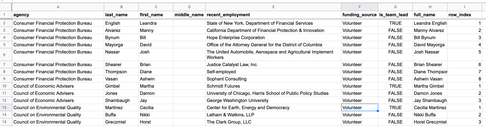

# Archive and scrape of Biden-Harris Transition Agency Review Team Members

> **tl;dr note:** if you just care about data scraped from the target page, jump to the [Scraped results section](#mark-scraped-results)

This repo contains a working mirror of the [Biden-Harris Transition Agency Review Teams announcement page](https://buildbackbetter.com/the-transition/agency-review-teams/) – and the wget script and other code to reproduce that mirror.

- Mirror: https://wgetsnaps.github.io/biden-harris-transition-teams/
- Original: https://buildbackbetter.com/the-transition/agency-review-teams/
- Wayback: http://web.archive.org/save/https://buildbackbetter.com/the-transition/agency-review-teams/
- Last updated: 2020-11-10

## Code and data

See [wgetsnap.sh](wgetsnap.sh) to see the `wget` code for mirroring the page.

### Scraped results

Because this mirrored page and its HTML tables have newsworth information, I've added a scraper script – [scrape/scraper.py](./scrape/scraper.py) – which parses and extracts the tabular data from [docs/index.html](docs/index.html) and outputs it as CSV.

**The scraped results can be found at**: [scrape/data.csv](scrape/data.csv) 

Or, if you'd like to see an interactive preview of the data on Google Sheets, [click here](https://docs.google.com/spreadsheets/d/18N7JDh_s5jqzQEe8qHfGexFy7dXrsgMrQBIk_X0om5A/edit#gid=0)

## Related links

- @Transition46 tweet: https://twitter.com/Transition46/status/1326257434080522241
- @alexkotch critiquing the announced teams: https://twitter.com/alexkotch/status/1326266162330669056

## Developer notes

If you've cloned this repo and want to recreate the wget mirror yourself, check out the [Makefile](Makefile).

Basically:

- `make snap` to execute script(s) for creating a mirror of the target site mirroring the target site (if ./docs doesn't already exist)

- `make serve` to view the locally mirrored site

- `make clean`  to clean out an existing mirror (wget.log and ./docs/)

